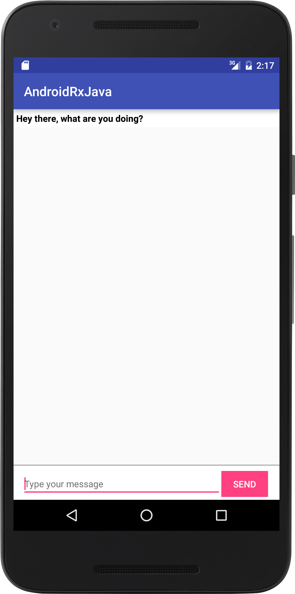

**My ways to understand rxJava for Android**   
1. **Undertand the concept**   
  a. General concept- in rxJava,      
  b. Observable - the object that emits data.  
  c. Susbcriber - The object receives the data emitted by the Observable  
  d. Operators - Operators are used to manipulate the data emitted by the Observable before  it reaches the subscriber. There are many operators such as map, filter, merge and more.  
  e. Subscription- this object is obtained when a subscriber registers to the observable. It lets us to unregister the subscriber from the observable.  
  e. Unscribe - we have to unregister the subscriber from the observable object. It is the best practice to stop the subscriber from receiving emitted item and  release resources (to prevent a possible memory leak).    

2. **Implement a step-by-step example**  
**Example Description:** Take look at the screenshot below. We want to display the text the user enters in the EditText field after clicking the button "Send".  
**RxJva step-by-step usage:**  When user clicks the button "Send", the text is displayed only if the text is not empty. Therefore:  
  1. *Create an observable by binding the button to the RxJava*  
    + Create a reference to the button "Send" from the xml file
    ```java
    Button sendMsgBtn = (Button) findViewById(R.id.sendUserMessage);
    ```
    + Bind the sendMsBtn (a button) to the RxJava using RxBinding library
    ```java
    RxView.clicks(sendMsgBtn)
    ```
    + By binding, a source observable is created. This observable emits an item every time button "sendMsgBtn" is clicked.
    ```java
    Observable<Void> clickObservable = RxView.clicks(sendMsgBtn);
    ```

    + The type of the item emitted by the observable is of type Void, that's why we have observable clickObservable of type Void:
    ```java
    Observable<Void> clickObservable
    ```
  2. *Use the operator map() to get the text from the EditText*      
    + the map() operator transforms the emitted item into another.
    + For this case, the item of type Void emitted by source observable "Observable<Void> clickObservable" will be transformed into String type. Because the text comes from the EditText, the emitted item of type Void is not used, instead the map() operator gets the text from the EditText and returns it as String type.
    ```java
    // Get reference to the EditText used by the user to enter message
    final EditText userText = (EditText) findViewById(R.id.chat_user_message);
    ```
    ```java
    // Apply map() operator to emitted item
    clickObservable.map(new Func1<Void, String>() {
            @Override
            public String call(Void aVoid) {
                return userText.getText().toString(); // Get text from EditText and return it as string
            }
        });
    ```
    + After transformation, the map operator returns an observable that emits item of type String:
        ```java
    // An observable of type String after applying map() operator to clickObservable
    Observable<String> observableAfterMap = clickObservable.map(new Func1<Void, String>() {
        @Override
        public String call(Void aVoid) {
            return userText.getText().toString(); // Return string
        }
    });
    ```
  3. Use the operator filter() to emit item only if text exists
    + The filter() operator checks if the item of type String emitted by Observable<String> observableAfterMap is not empty. If it is empty, there is no item is emitted. If the result is a true Boolean from the condition inside the filter() operator, the item is emitted, otherwise no item is emitted :
    ```java
    // Emit item if message
observableAfterMap.filter(new Func1<String, Boolean>() {
            @Override
            public Boolean call(String s) {
              // Check the message is not empty
                return !TextUtils.isEmpty(s);
            }
        });
```
    + After filtering, the map() operator returns an observable of type String which emits item only if the result from the condition is true:
   ```java
   // An observable of type String after applying filter() operator to observableAfterMap
   Observable<String> observableAfterFilter = observableAfterMap.filter(new Func1<String, Boolean>() {
       @Override
       public Boolean call(String s) {
           return !TextUtils.isEmpty(s);
       }
   });
```
  4. Get Subscription  by registering subscriber to observable     
  5. Unscribe subscriber from observable
   
